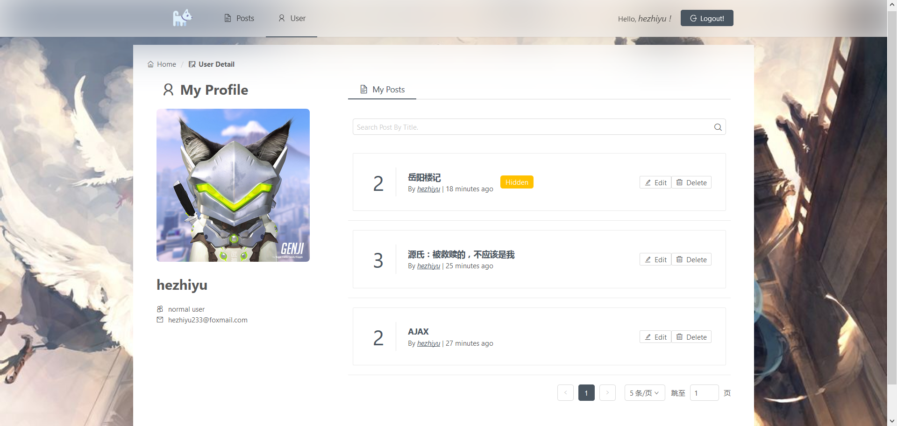
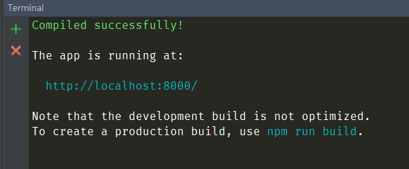

# My Blog App

## OverView



### 项目原要求

[Homework 12 Blog](http://my.ss.sysu.edu.cn/wiki/display/WEB/Homework+12+Blog)

## 如何启动项目？

```bash
$ git clone https://github.com/HeskeyBaozi/dva-blog-crud-demo.git
```

- 请确保你的`node.js`版本在`6.5`以上, 否则可能会报错
- 默认的`npm`包地址使用国内淘宝镜像，可以在根目录下`.npmrc`内修改镜像源

```bash
$ npm install
```

- 在保证后端服务器开启情况下
```bash
$ npm start
```

- 其中代理设置为, 将所有`/api`请求代理到后端`API`, 这里后端监听端口为`5858`
```json
{
  "proxy": {
        "/api": {
            "target": "http://localhost:5858/api/v1",
            "changeOrigin": true,
            "pathRewrite": {
                "^/api": "/api"
            }
        }
    }
}
```

- 终端在正常打开后如下显示，并且会自动打开浏览器标签访问 [http://localhost:8000](http://localhost:8000)



- 内置一个管理员

username: `admin` password: `admin`

- 内置两个普通用户

username: `hezhiyu` password: `hezhiyu`

username: `normal` password: `normal`

## 数据设计

coming...