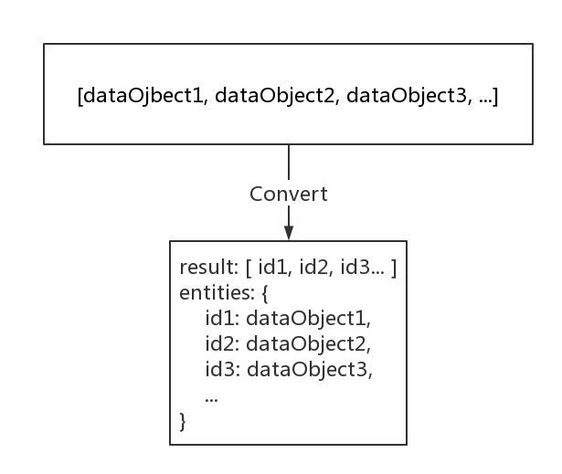

# My Blog App

此项目是我刚接触`React`生态（2016年）的练手项目，现已过时。
此项目中的`Dva`是基于1.x的，现在官方已更新至2.x。

如果您是初学者，或者您是工作中需求写业务代码较多的工作者。我的建议是直接上[umi.js](https://umijs.org/)。
可以搭配官方的`umi-plugin-dva`插件使用，也推荐选择另一种数据流`mobx`，并搭配我写的`umi-plugin-mobx`使用。

如果您是中山大学软件工程的学生且正在做`Web 2.0`课程的大作业项目参考。我的推荐是还是上[umi.js](https://umijs.org/)。因为助教和老师最后给分都是看成果和效果给分的。人生苦短，为了您的学分和休息时间。请直接使用开箱即用的方案。

## OverView


### 项目原要求

[Homework 12 Blog](http://my.ss.sysu.edu.cn/wiki/display/WEB/Homework+12+Blog)

## 如何启动项目？

```bash
$ git clone https://github.com/HeskeyBaozi/dva-blog-crud-demo.git
```

- 请确保你的`node.js`版本在`6.5`以上, 否则可能会报错
- 默认的`npm`包地址使用国内淘宝镜像，可以在根目录下`.npmrc`内修改镜像源

```bash
$ npm install
```

- 开启后端服务器
[RESTful-blog-server-demo](https://github.com/HeskeyBaozi/RESTful-blog-server-demo)

在这个项目根目录下

```bash
$ npm install  // 安装服务端依赖
$ npm run db  // 开启mongoDB 默认路径为./data
$ npm start
```
此时服务器会在`5858`端口开启

- 在保证后端服务器开启情况下
```bash
$ npm start
```

- 其中代理设置如下 (此设置将所有`/api`请求代理到后端`API`, 这里后端监听端口为`5858`)
```json
{
  "proxy": {
        "/api": {
            "target": "http://localhost:5858/api/v1",
            "changeOrigin": true,
            "pathRewrite": {
                "^/api": "/api"
            }
        }
    }
}
```

- 终端在正常打开后如下显示，并且会自动打开浏览器标签访问 [http://localhost:8000](http://localhost:8000)


- 内置一个管理员

username: `admin` password: `admin`

- 内置两个普通用户

username: `hezhiyu` password: `hezhiyu`

username: `normal` password: `normal`

## 数据设计

### 登录流


`models/app`负责全局的登录状态管理。

在路由控制中，使用`react-router`的`onEnter`钩子保证在进入需要授权的页面中登录状态是保持的。
```javascript
function requireAuth(nextState, replace, callback) {
    app._store.dispatch({
        type: 'app/enterAuth',
        payload: {},
        onComplete: callback // enter the component
    });
}

function* enterAuth({payload, onComplete}, {put, take}) {
    yield [put({type: 'checkToken'}), put({type: 'queryUser'})];
    yield [take('app/hasToken'), take('app/queryUserSuccess')]; // promise the logged state
    onComplete();
}
```

### 总体思想

所有的组件都尽量是`stateless`, 所有的状态`connect`组件一般都是路由组件。所有的分发`dispatch`都交给了路由组件来完成。

这样我可以保证我可以复用一些`Dumb`组件，比如`PostsListBody`这个组件，既可以在文章列表页面使用，也可以在用户页面查看自己的文章列表使用。

#### 数据的获取

有两种方式。

一种是`dva.js`官方推荐的, 使用在`models/posts`

"订阅"数据源。这封装了[react-redux-router](https://github.com/reactjs/react-router-redux)增强的`history`。

这样可以监听路由的变化，比如说下面在进入`/posts`时，会发起一个获取文章列表的`action`.

```javascript
app.model({
    subscriptions: {
        setup: function ({history, dispatch}) {
            history.listen(location => {
                if (pathToRegExp('/posts').exec(location.pathname)) {
                    dispatch({
                        type: 'fetchPostsList',
                        payload: {pageInfo: {limit: 5, page: 1}}
                    });
                }
            });
        }
    }
});
```

还有一种是进入一些页面时，要保证一些数据已经在`state`中了。这时我还是使用了`react-router`的`onEnter`钩子。

比如说在进入文章详细页面时，需要知道文章的基本元信息，标题作者等等。等到元信息加载完，再进入页面。

语法层面上上，多亏了有`saga`的各种`effects`创建器。可以很爽地写出各种异步代码

```javascript
function requirePostPrepared(nextState, replace, callback) {
    app._store.dispatch({
        type: 'post_detail/initializePostDetail',
        payload: {post_id: nextState.params.post_id},
        onComplete: callback
    });
}

function* initializePostDetail({payload, onComplete}, {put, call}) {
    yield put({type: 'clear'});
    const {post_id} = payload;
    const {data} = yield call(fetchPostInfo, {post_id});
    if (data) {
        yield put({
            type: 'saveInitialPostDetailInfo',
            payload: {postInfo: data}
        });
        onComplete(); // enter the component
        
        // then fetch the data
        yield [
            put({type: 'fetchPostContent'}),
            put({type: 'fetchPostComments'})
        ];
    }
}
```

### 文章列表

使用`normalizr`将获取到的文章数组扁平化，方便后续修改`visible`可见状态等。

原理如图：



这样在获取数据源展示数据时，即可使用一条语句
```javascript
const dataSource = postsList.map(post_id => postsById[post_id]).filter(post => post);
```
